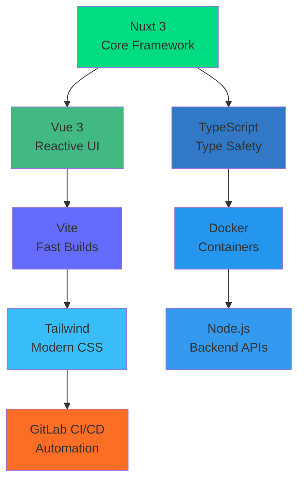

# 🔥 Владимир Хлюпнев
**Frontend Architect | Vue/Nuxt Team Lead | Performance Wizard**

> Создаю высоконагруженные веб-приложения: **Vue 3/Nuxt 3**, **TypeScript**, **PWA**, **SSR/SSG/ISR**. Архитектура FSD/Atomic, интеграции **Java/Spring**, **Go**, **Node.js**. **CI/CD**, **Docker**, **Kubernetes**, **Keycloak/OIDC**.

## 🛠️ Tech Stack

<table align="center">
<tr>
  <td align="center" width="16%">
     <b>Vue 3</b>
  </td>
  <td align="center" width="16%">
     <b>Nuxt 3</b>
  </td>
  <td align="center" width="16%">
     <b>TypeScript</b>
  </td>
  <td align="center" width="16%">
     <b>Vite</b>
  </td>
</tr>
<tr>
  <td align="center" width="16%">
     <b>PWA</b>
  </td>
  <td align="center" width="16%">
     <b>Tailwind</b>
  </td>
  <td align="center" width="16%">
     <b>Docker</b>
  </td>
  <td align="center" width="16%">
     <b>K8s</b>
  </td>
</tr>
</table>

## 🚀 Недавние проекты

## 🎯 Контакты

<a rel="nofollow noopener" class="reset interactable cursor-pointer decoration-1 underline-offset-1 text-super hover:underline font-semibold" target="_blank" href="https://t.me/ProKsiKzzz"></a> 
<a rel="nofollow noopener" class="reset interactable cursor-pointer decoration-1 underline-offset-1 text-super hover:underline font-semibold" target="_blank" href="mailto:proksik49032@mail.ru"></a> 
<a rel="nofollow noopener" class="reset interactable cursor-pointer decoration-1 underline-offset-1 text-super hover:underline font-semibold" target="_blank" href="https://vk.com/poksiks"></a>

## 📊 Статистика разработки

